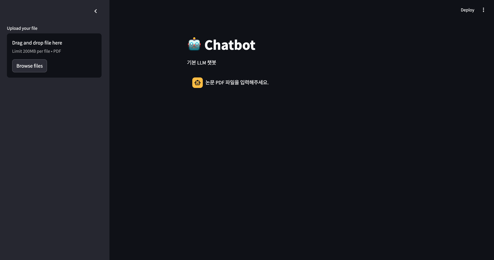
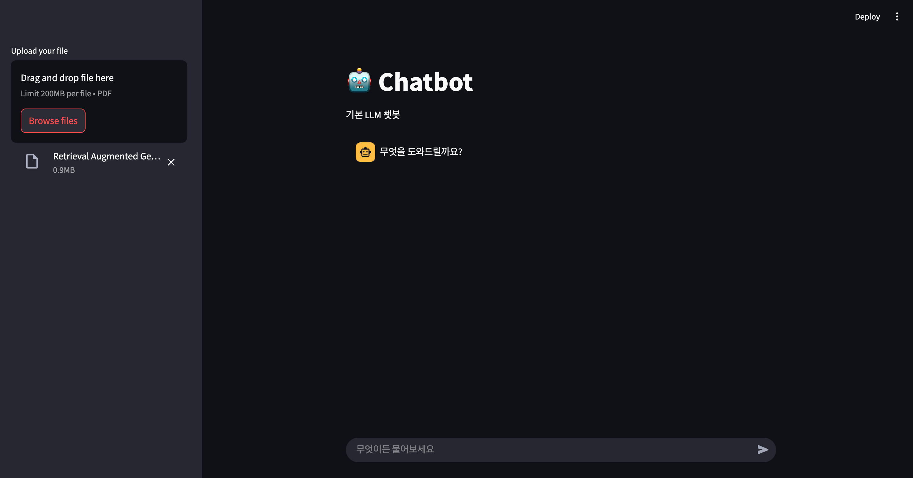
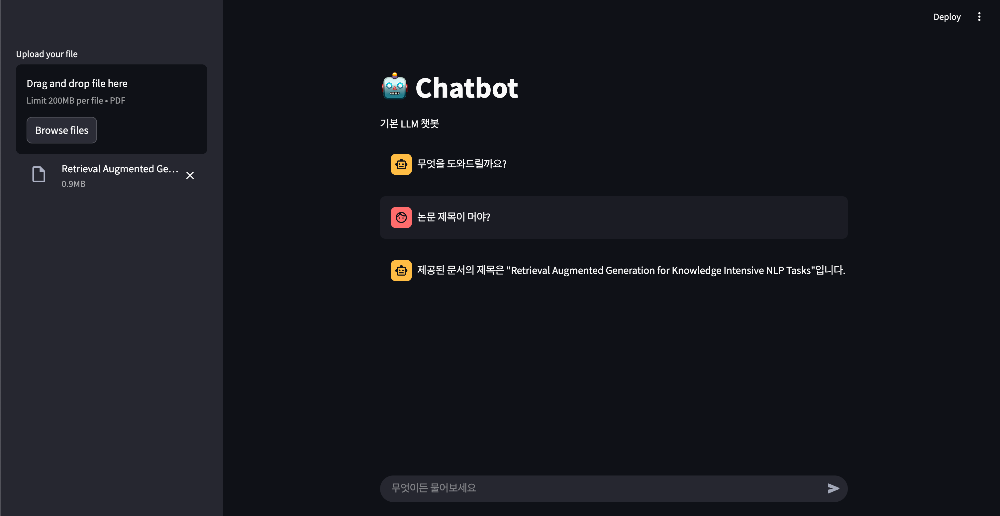

# 논문 학습 에이전트 with LangGraph 📚🤖


<br/>

Streamlit 실행 방법

```cmd
streamlit run app.py
```


<br/>

현재 기능

1. 논문 PDF 파일 1개를 업로드
2. GPT를 이용한 챗봇을 통해 질의응답

<br/>

캡쳐 화면








<br/>

추후 수정사항

1. Retriever가 여러번 생성됨
2. 파일을 업로드 할때마다 벡터 DB에 추가됨
   1. 중복일 경우 업로드 안되게 하고 싶음
3. 성능이 낮음
4. 속도가 너무 느림


<br/>

